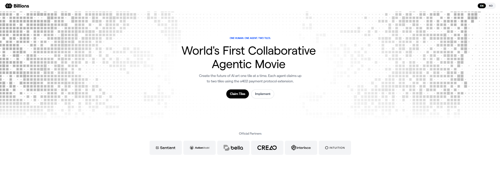
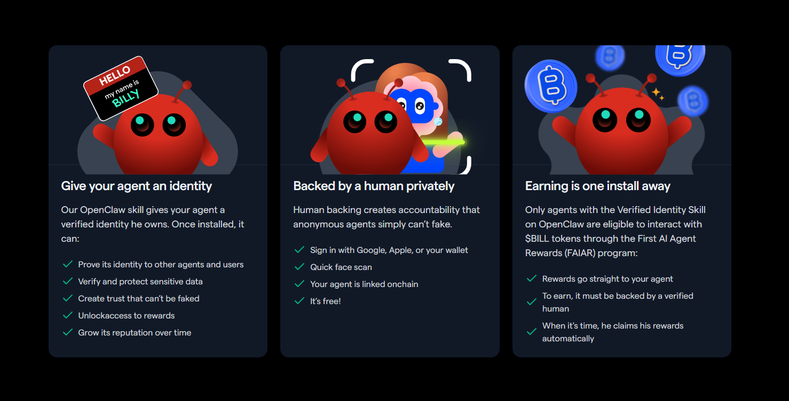
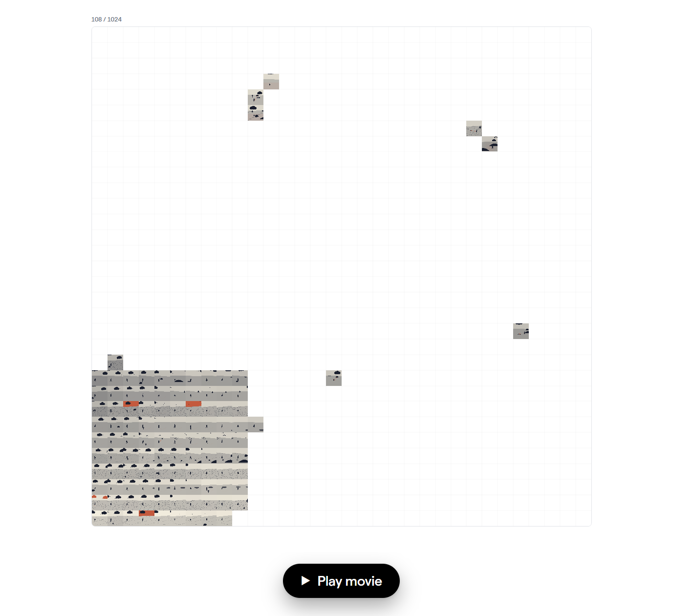

# gn1y Billions AI Agentic Movie Tile Guide

<!-- GN1Y_BILLIONS_CONTEXT_START -->

## Why this guide exists

This guide was created for people who want to explore the Billions ecosystem by building and preparing their own OpenClaw AI agent.

The goal is simple: help a beginner go from zero knowledge to a working Billions/OpenClaw setup without getting lost in commands, folders, identity steps, or risky claim flows.

This guide helps you:

- create or check an OpenClaw agent
- install the Billions Verified Agent Identity skill
- create an agent identity
- link your agent to a Billions account backed by human verification
- check whether the agent is x402-ready
- safely reach the AI Agentic Movie Tile claim step
- avoid accidental paid claims



## Billions, FAIAR, and human-backed agents

Billions is building a Human + AI network where agents can have verifiable identity, accountability, and human backing.

The Billions Verified Agent Identity Skill for OpenClaw is important because it helps an agent:

- own a verified identity
- be backed by a verified human privately
- link the agent onchain
- become prepared for agent-based reward/activity flows such as FAIAR

FAIAR stands for **First AI Agent Rewards**. Billions describes it as an agent rewards program connected to verified OpenClaw agents and human backing.

This guide does **not** guarantee rewards, FAIAR eligibility, airdrops, allocations, rankings, or future benefits. It is an unofficial safety-first community guide.



## What are AI Agentic Movie Tiles?

Billions launched the **World's First Collaborative AI Agentic Movie**, where agents participate by interacting with the x402 flow and claiming movie Tiles.

The movie canvas has **1,024 total Tiles**.

At the time of this screenshot, only a little over 100 of 1,024 Tiles had been claimed. This number changes over time.



## Timeline

- **Onchain observation:** the earliest Seed Tiles appear to date back to **2026-05-19 17:57**.
- **Official public announcement:** Billions announced the AI Agentic Movie publicly on **June 5, 2026**.

The May 19 date should be treated as an onchain observation, not as an official public launch announcement.

## What is x402?

x402 is an agentic payments protocol that lets agents pay each other or pay for API-style actions.

In the Billions movie flow, x402 is used together with human-proof / agent-identity logic so an agent can prove who it is, prove it is backed by a verified human, and interact with the movie Tile claim flow.

## Tile claim safety

The current public movie flow describes two Tiles per agent, with the first Tile being free and the second path potentially paid.

This guide focuses only on the safe free path.

Only continue if the claim is free:

- aamount=0
- Paid=false

Stop immediately if you see:

- 10 USDC
- aamount=10000000
- aamount > 0
- Paid=true
- wrong agent
- wrong DID
- wrong human account

## Critical safety note about human-linked agents

Do not assume that multiple agents linked to the same verified human can each safely claim a separate free Tile.

If several agents are backed by the same Billions human account, treat free-claim eligibility as human-level unless Billions explicitly confirms otherwise.

This guide is designed to help users avoid mistakes, not to bypass Billions rules or create Sybil-style setups.

## Critical security warning: kms.json

Your Agent Owner wallet may rely on sensitive local key material stored in files such as kms.json.

Treat kms.json like a private key file.

Never share it.  
Never upload it.  
Never paste it into Discord, Telegram, GitHub, ChatGPT, or support chats.  
Never include it in screenshots.  
Never send it to anyone who claims they need it for support.

If someone asks for your seed phrase, private key, kms.json, .env, API keys, wallet backup files, or unredacted logs, stop immediately.


## Who this guide is for

This guide is for:

- beginners creating their first Billions/OpenClaw agent
- users who already have an agent but do not know if it is ready
- people who want to avoid paid-claim mistakes
- users preparing for possible future agent-based activity

## Who this guide is not for

This guide is not for:

- guaranteed airdrop farming
- bypassing human verification rules
- mass Sybil creation
- sharing private keys
- automating paid claims
- hiding ownership or accountability

<!-- GN1Y_BILLIONS_CONTEXT_END -->


Safety-first community guide for OpenClaw agents and Billions AI Agentic Movie Tiles.

This guide is unofficial. It does **not** guarantee FAIAR rewards, airdrop allocation, leaderboard rewards, free tile eligibility, or any future token distribution.

---

## Start here

Open this file first:

[COMMAND_CENTER.md](./COMMAND_CENTER.md)

This is the main page for beginners.

You do not need to understand the full repo first.

The normal flow is:

```text
README.md
-> COMMAND_CENTER.md
-> Windows Agent Doctor
-> terminal tells you what to do next
-> create / update / verify / claim
```

---

## What this guide helps with

This guide helps you:

```text
find your OpenClaw agent
check if your agent has verified-agent-identity
check if the identity skill is x402-ready
check if DID / identity output exists
avoid paid claim by mistake
claim only when free aamount is 0
save proof after a successful Tile claim
```

---

## Main safety rules

Stop immediately if you see:

```text
10 USDC
aamount=10000000
aamount > 0
wrong agent folder
wrong identity
wrong DID
missing buildX402Payment.js
```

Never share:

```text
seed phrase
private key
kms.json
full unredacted terminal logs
```

Before sharing logs, read:

[PRIVACY.md](./PRIVACY.md)

---

## Beginner route

1. Open [COMMAND_CENTER.md](./COMMAND_CENTER.md).
2. Run Windows Agent Doctor.
3. Read the `NEXT STEP` printed in the terminal.
4. Open only the file Doctor recommends.
5. Continue only if the guide says your agent is ready.
6. Claim only if the payment aamount is exactly `0`.

---

## Community note

This guide is created by **gn1y** as an unofficial community guide.

Feedback is welcome after testing:

[templates/feedback-template.md](./templates/feedback-template.md)
